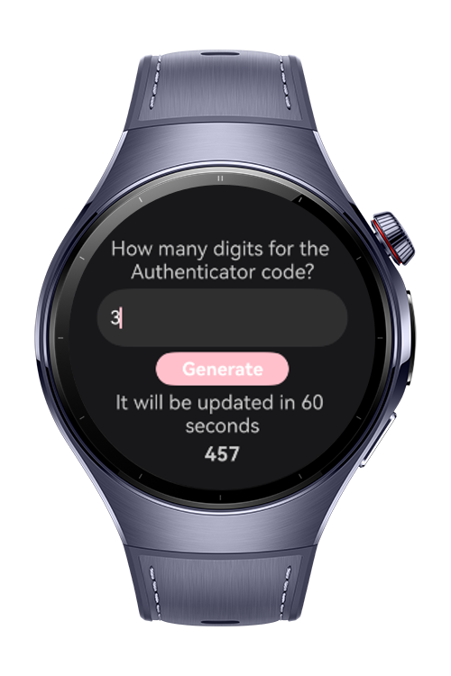
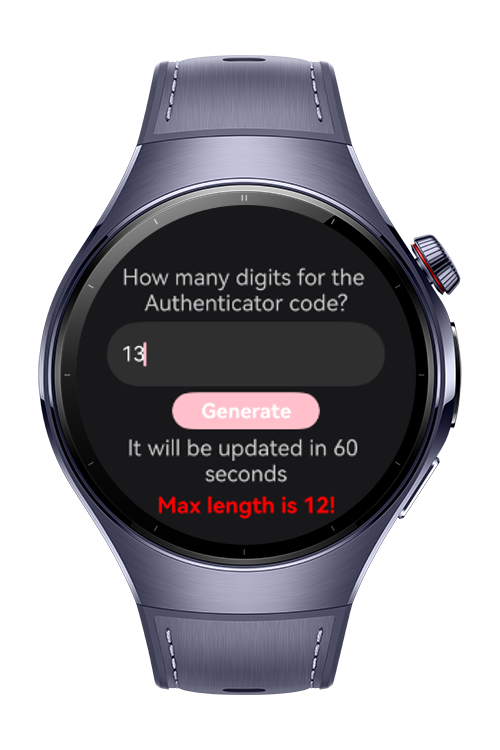

> **Note:** To access all shared projects, get information about environment setup, and view other guides, please visit [Explore-In-HMOS-Wearable Index](https://github.com/Explore-In-HMOS-Wearable/hmos-index).

# We Authenticator App

This application is a multi-purpose security tool built with CryptoArchitectureKit to generate cryptographically secure random values.
It consists of three main modules:

1. Digit Generator – Creates numeric verification codes (similar to an authenticator) with a user-defined length, refreshing automatically every 60 seconds.

2. QR Code Generator – Generates QR codes from random numeric values and allows the user to create a new QR code on demand.

3. Strong Password Generator – Produces secure and random passwords based on user preferences, including numbers, special characters, and uppercase letters.

# Preview

<div>
   
   
   
   
</div>

# Use Cases

1. Two-Factor Authentication: Users can generate one-time passcodes (OTPs) for secure login processes.

2. Temporary PIN Codes: The app can be used to create temporary PIN numbers for locking or unlocking apps, files, or devices.

3. Password Helper: Instantly generate strong, unpredictable passwords for protecting accounts and applications.

4. Learning & Testing Cryptographic Functions: Developers can use the app as a lightweight example to understand and experiment with HarmonyOS’s Crypto Architecture Kit.

5. Time-Based Code Refresh: Security-sensitive scenarios where codes must refresh periodically (e.g., every 60 seconds) can be simulated.

6. Secure Login & Sharing: Create and scan QR codes for safe data transfer or login processes.
# Tech Stack

- **Languages**: ArkTS
- **Frameworks**: HarmonyOS SDK 5.1.0(18)
- **Tools**: DevEco Studio Vers 5.1.0.842
- **Libraries**: @kit.CryptoArchitectureKit, @kit.ArkUI

# Project Directory
   ```
   entry/src/main/ets/
   |---pages
   |   |---Index.ets                                 // Home Page
   |   |---DigitGenerator.ets                        // Digit Password Generator - Includes only numbers
   |   |---QRCodeGenerator.ets                       // QR Code Generator
   |   |---StrongPasswordGenerator.ets               // Strong Password Generator - includes numbers, special characters, and uppercase letters
   ```
# Constraints and Restrictions
## Suported Devices
- Huawei Watch 5

# Limitations
- Crypto Architecture Kit is not working on the previewer.

# License
**WeAuthenticatorApp** is distributed under the terms of the MIT License
See the [LICENSE](./LICENSE) for more information.